# Flask + MongoDB CI/CD Pipeline — GitHub Actions, Docker, ECR, EC2

This README documents a complete, beginner-friendly path to building the CI/CD pipeline required for the **CI/CD Pipeline Assignment** (Student Registration System — Flask + MongoDB). It uses **GitHub Actions** as the automation engine, **Docker** for packaging, **Amazon ECR** as the image registry, and **Amazon EC2** as the deploy target, with **email notifications** on every run.

Follow the steps in order. Each step explains *what* to do, *why* it matters, and *how* it maps to the grading rubric.

---

## Table of Contents

1. [What You're Building](#1-what-youre-building)
2. [Prerequisites](#2-prerequisites)
3. [Architecture](#3-architecture)
4. [Step 1 — Fork and Clone the Repository](#step-1--fork-and-clone-the-repository)
5. [Step 2 — Add a Dockerfile](#step-2--add-a-dockerfile)
6. [Step 3 — Add a `.dockerignore`](#step-3--add-a-dockerignore)
7. [Step 4 — Add the `/health` Endpoint](#step-4--add-the-health-endpoint)
8. [Step 5 — Add Tests for `/health`](#step-5--add-tests-for-health)
9. [Step 6 — Add `.env.example` and Update `.gitignore`](#step-6--add-envexample-and-update-gitignore)
10. [Step 7 — Set Up AWS (ECR + EC2)](#step-7--set-up-aws-ecr--ec2)
11. [Step 8 — Configure GitHub Secrets](#step-8--configure-github-secrets)
12. [Step 9 — Write the GitHub Actions Workflow](#step-9--write-the-github-actions-workflow)
13. [Step 10 — Run the Pipeline End to End](#step-10--run-the-pipeline-end-to-end)
14. [Step 11 — Test the Failure Path](#step-11--test-the-failure-path)
15. [Step 12 — Take Your Screenshots](#step-12--take-your-screenshots)
16. [Security Notes](#security-notes)
17. [Troubleshooting](#troubleshooting)
18. [Submission Checklist](#submission-checklist)
19. [Grading Rubric Map](#grading-rubric-map)

---

## 1. What You're Building

A push to `main` on GitHub should, with no manual steps, automatically:

1. Pull the latest code.
2. Install dependencies.
3. Run the `pytest` suite — **stop immediately if any test fails**.
4. Build a Docker image, tagged with the Git commit SHA.
5. Push that image to Amazon ECR.
6. SSH into an EC2 instance, pull the new image, stop the old container, start the new one.
7. Curl the `/health` endpoint to confirm the app actually came up.
8. Email you a **success** or **failure** report with real build details — not a generic "build finished" message.

You will not change the Flask app's existing routes or logic — only add the `/health` route, a Dockerfile, and the workflow definition.

---

## 2. Prerequisites

Before you start, make sure you have:

- A **GitHub account** with the [flask_Practice](https://github.com/mohanDevOps-arch/flask_Practice) repo forked to your account.


- An **AWS account** (the free tier covers everything here: one `t2.micro` EC2 instance and a small ECR repo).


- **Git**, **Docker**, and **Python 3.10+** installed locally, so you can test things before pushing and letting the pipeline run.


- A **Gmail account** (or any SMTP provider) to send pipeline emails from. If using Gmail, you'll need an **App Password** (Google Account → Security → 2-Step Verification → App Passwords), not your normal password.

- Basic comfort with a terminal. Every command below is copy-pasteable — you don't need prior GitHub Actions/AWS/Docker experience.

> New to all of this? That's fine — each step below explains the concept before the command. One nice thing about GitHub Actions: there's no separate server to install or maintain (unlike Jenkins) — GitHub runs the pipeline for you on hosted runners, triggered automatically by your `on: push` config.

---

## 3. Architecture

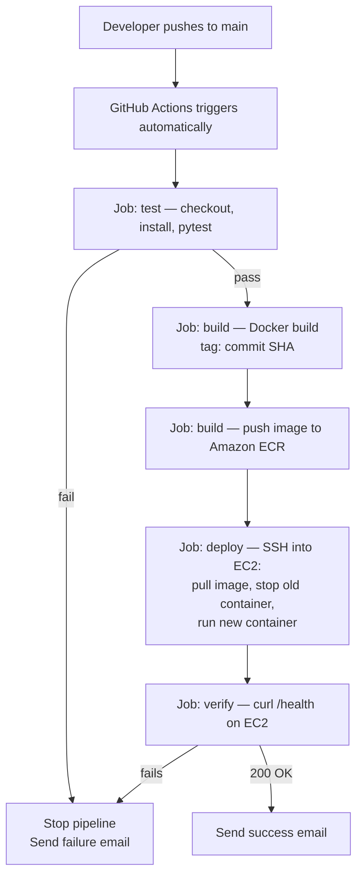

**Components:**

| Component | Role |
|---|---|
| GitHub | Source control **and** CI/CD engine — `on: push` triggers the workflow natively, no webhook to configure |
| GitHub Actions | Runs the pipeline stages as jobs on hosted, disposable runners |
| Docker | Packages the Flask app into a portable image |
| Amazon ECR | Stores versioned, commit-SHA-tagged images |
| Amazon EC2 | Runs the live container; has an IAM role to pull from ECR |
| MongoDB | The app's database — connectivity is checked by `/health` |
| GitHub Secrets | Encrypted storage for AWS keys, the EC2 SSH key, and SMTP credentials |
| Email (SMTP) | Reports pipeline outcome with real build details |

---

## Step 1 — Fork and Clone the Repository

**Why:** You need your own copy of the repo so GitHub Actions runs against *your* code, and so pushes to *your* `main` branch trigger the pipeline.

1. Open the [flask_Practice repo](https://github.com/mohanDevOps-arch/flask_Practice) and click **Fork** (top right) → fork into your own account.


2. Clone your fork locally:
   ```bash
   git clone https://github.com/<your-username>/flask_Practice.git
   cd flask_Practice
   ```


3. Confirm the existing structure:
   ```bash
   ls
   # app.py  requirements.txt  test_app.py  templates/  ...
   ```


   
4. Open `app.py` and note:
   - The Flask app variable name (usually `app = Flask(__name__)`).
   - How MongoDB is connected (look for `MongoClient(...)` or a `pymongo` import) — you'll need this variable name for the `/health` route in Step 4.
   - What host/port it runs on at the bottom of the file (`app.run(...)`). It must bind to `0.0.0.0`, not `127.0.0.1`, or the app will be unreachable from outside its Docker container. If you see `app.run(debug=True)` with no host, change it to:
     ```python
     if __name__ == "__main__":
         app.run(host="0.0.0.0", port=5000)
     ```

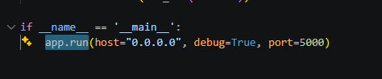

---

## Step 2 — Add a Dockerfile

**Why:** Docker packages your app plus its exact Python environment into one portable image, so "works on my machine" becomes "works everywhere," including on your EC2 instance.

Create `Dockerfile` in the repo root:

```dockerfile
# Use a small, stable Python base image
FROM python:3.11-slim

# Set the working directory inside the container
WORKDIR /app

# Install dependencies first (better layer caching — this layer only
# rebuilds when requirements.txt changes, not on every code change)
COPY requirements.txt .
RUN pip install --no-cache-dir -r requirements.txt

# Now copy the rest of the application code
COPY . .

# The Flask app listens on this port
EXPOSE 5000

# Run the app
CMD ["python", "app.py"]
```
*Important*: Run the Project with the below steps:

```bash
python3 -m venv venv
source venv/bin/activate        # Windows: venv\Scripts\activate
pip install -r requirements.txt
pytest -v
```
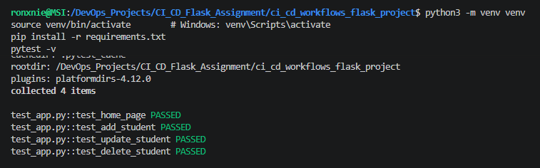

Build and test it locally before touching GitHub or AWS:

```bash
docker build -t flask-student-registration:local .
docker run -p 5000:5000 --env-file .env flask-student-registration:local
```

Visit `http://localhost:5000` — if the app loads, your Dockerfile works. If it doesn't connect to Mongo, check your `MONGO_URI` (see Step 6).

---

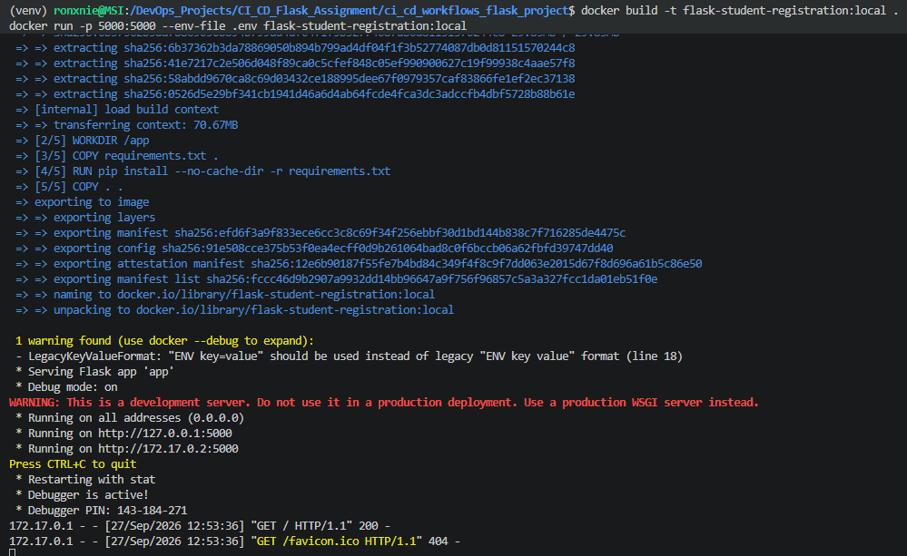

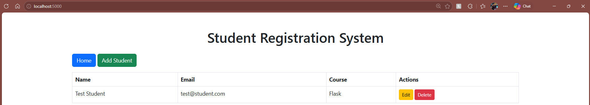

## Step 3 — Add a `.dockerignore`

**Why:** Keeps secrets, virtual environments, and junk files out of your Docker build context — smaller, faster, safer images.

Create `.dockerignore`:

```dockerignore
__pycache__/
*.pyc
*.pyo
.env
.git
.gitignore
.pytest_cache/
venv/
*.pem
README.md
```

---

## Step 4 — Add the `/health` Endpoint

**Why:** This is your **deploy-verification gate**. A container can start and still be broken (e.g., wrong Mongo URI). `/health` proves the app is *actually* working, not just that a process is running.

Add this to `app.py` (adjust `mongo_client` to match whatever variable your app already uses for its `MongoClient`):

```python
from flask import jsonify

@app.route("/health")
def health():
    """Deployment verification gate — checks the app process AND
    the MongoDB connection, since a running-but-disconnected app
    should count as a failed deployment."""
    try:
        # Replace `mongo_client` with your actual MongoClient/PyMongo instance
        mongo.db.command('ping') 
        return jsonify(status="healthy", database="connected"), 200
    except Exception as e:
        return jsonify(status="unhealthy", database="disconnected", error=str(e)), 503
```

> If your app uses Flask-PyMongo instead of a raw `MongoClient`, swap the ping line for `mongo.cx.admin.command("ping")` (Flask-PyMongo exposes the client at `mongo.cx`).

Test locally:
```bash
curl http://localhost:5000/health
```

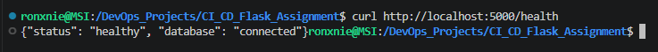

You should get a `200` with `{"status": "healthy", ...}` when Mongo is reachable, and `503` when it isn't (try stopping your local Mongo to confirm the failure path too).

---

## Step 5 — Add Tests for `/health`

**Why:** The pipeline's **Test** job is the gate that stops broken code from ever reaching build/deploy — it needs something to actually test.

Add to `test_app.py`:

```python
def test_health_endpoint_returns_status(client):
    response = client.get("/health")
    assert response.status_code in (200, 503)
    data = response.get_json()
    assert "status" in data
    assert data["status"] in ("healthy", "unhealthy")
```

If `test_app.py` doesn't already have a `client` pytest fixture, add one near the top of the file (adjust the import to match your `app.py`):

```python
import pytest
from app import app as flask_app

@pytest.fixture
def client():
    flask_app.config["TESTING"] = True
    with flask_app.test_client() as client:
        yield client
```

Run the suite locally:
```bash
pip install -r requirements.txt
pytest -v
```
All tests should pass before you move on — the workflow will run this exact command.

---

## Step 6 — Add `.env.example` and Update `.gitignore`

**Why:** Real secrets (Mongo URIs, keys) must never be committed. `.env.example` documents *which* variables are needed without exposing real values.

Create `.env.example`:
```
MONGO_URI=mongodb://<username>:<password>@<host>:27017/<db-name>
FLASK_ENV=production
SECRET_KEY=changeme
```

Add to (or create) `.gitignore`:
```
.env
*.pem
__pycache__/
venv/
*.pyc
.pytest_cache/
```

Copy `.env.example` to `.env` locally and fill in real values for local testing — **never commit `.env`**.

---

## Step 7 — Set Up AWS (ECR + EC2)

Do this manually, once, before the pipeline exists. The pipeline only *uses* these resources — it doesn't create them.

### 7a. Create the ECR repository

Console: **ECR → Create repository** → name it e.g. `flask-student-registration` → private visibility → Create.

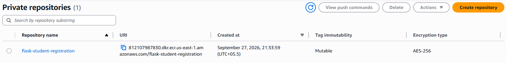

Or via CLI (if you have the AWS CLI configured locally):
```bash
aws ecr create-repository \
  --repository-name flask-student-registration \
  --region ap-south-1
```
Note the **repository URI** it returns — you'll need it later.

Repository URI: 812107987830.dkr.ecr.us-east-1.amazonaws.com/flask-student-registration

### 7b. Create an IAM user for GitHub Actions → ECR push

GitHub Actions runs on GitHub's own servers, not on AWS, so it needs its own credentials (unlike the EC2 instance, which can use an instance role).

1. **IAM → Users → Create user**, e.g. `github-actions-ecr-push`, **programmatic access only** (no console password).
2. Attach policy: `AmazonEC2ContainerRegistryPowerUser`.
3. Create the user, then generate an **Access Key** for it (IAM → Users → your user → Security credentials → Create access key → "Third-party service" use case). Save the **Access Key ID** and **Secret Access Key** — you'll store these as GitHub Secrets in Step 8.

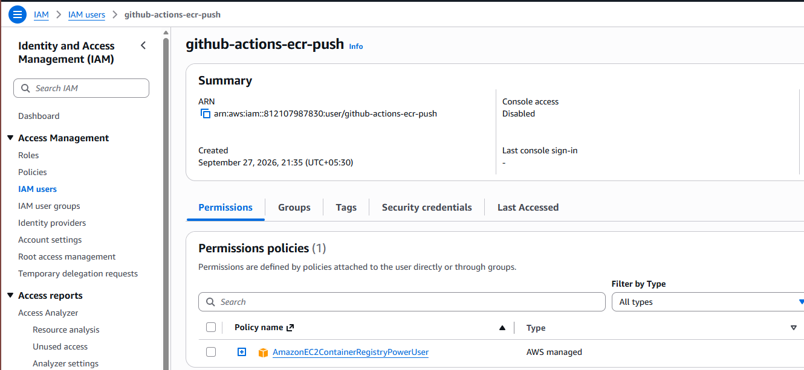

### 7c. Create an IAM role for EC2 → ECR pull

This lets your EC2 instance pull images from ECR **without** storing AWS keys on it.

1. **IAM → Roles → Create role** → Trusted entity: **AWS service → EC2**.
2. Attach policy: `AmazonEC2ContainerRegistryReadOnly`.
3. Name it e.g. `ec2-ecr-pull-role` → Create.

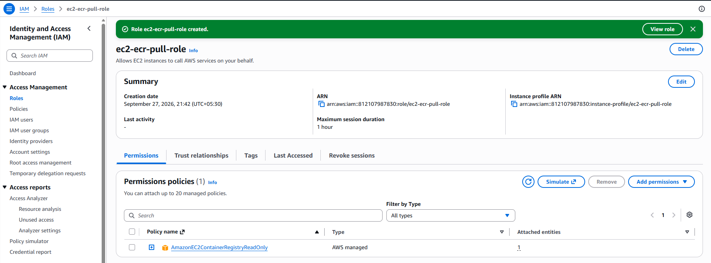

### 7d. Launch the EC2 instance

1. **EC2 → Launch instance**.
2. AMI: **Ubuntu Server 22.04 LTS**.
3. Instance type: `t2.micro` (free tier).
4. Key pair: create a new one, e.g. `flask-deploy-key.pem`, and **download it** — you cannot re-download it later. Keep it safe; its contents will become a GitHub Secret in Step 8, and it must never be committed to the repo.
5. Network settings — **security group**:
   - Allow **SSH (22)** — restrict the source to *your* IP, not `0.0.0.0/0`.
   - Allow **Custom TCP 5000** from `0.0.0.0/0` (so the app is reachable) — document this choice (done — see [Security Notes](#security-notes)).
6. Advanced details → **IAM instance profile** → select `ec2-ecr-pull-role` from Step 7c.
7. Launch.

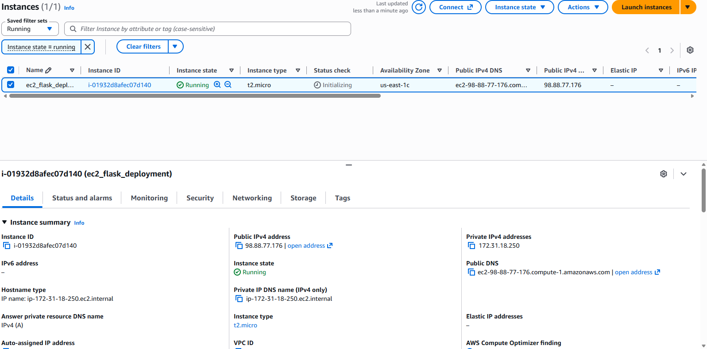

### 7e. Install Docker on the EC2 instance

SSH in:
```bash
chmod 400 flask-deploy-key.pem
ssh -i flask-deploy-key.pem ubuntu@<EC2-PUBLIC-DNS>
```

Then install Docker and the AWS CLI:
```bash
sudo apt update
sudo apt install -y docker.io awscli
sudo systemctl enable docker --now
sudo usermod -aG docker ubuntu
# log out and back in for the group change to apply
exit
ssh -i flask-deploy-key.pem ubuntu@<EC2-PUBLIC-DNS>
docker ps   # should run without needing sudo
```

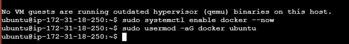

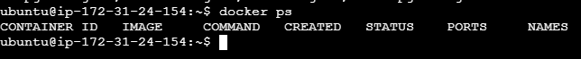

### 7f. Store the real MongoDB URI on the EC2 instance

The container needs `MONGO_URI` at runtime. Create an env file on the instance (never in the repo):
```bash
cat > /home/ubuntu/app.env <<'EOF'
MONGO_URI=mongodb+srv://<user>:<password>@<cluster>/<db>
FLASK_ENV=production
SECRET_KEY=<a-real-secret>
EOF
chmod 600 /home/ubuntu/app.env
```
The workflow's deploy job will reference this file with `docker run --env-file`.

---

## Step 8 — Configure GitHub Secrets

**Why:** Every secret the pipeline touches (AWS keys, SSH key, SMTP password) must live in GitHub's encrypted secret store — never in the workflow file or the repo.

Go to your forked repo → **Settings → Secrets and variables → Actions → New repository secret**, and add each of these:

| Secret name | Value |
|---|---|
| `AWS_ACCESS_KEY_ID` | Access Key ID from the IAM user in Step 7b |
| `AWS_SECRET_ACCESS_KEY` | Secret Access Key from the IAM user in Step 7b |
| `AWS_ACCOUNT_ID` | Your 12-digit AWS account ID |
| `EC2_HOST` | Your EC2 instance's public DNS or IP |
| `EC2_USER` | `ubuntu` |
| `EC2_SSH_KEY` | The **full contents** of `flask-deploy-key.pem`, including the `-----BEGIN ... KEY-----` / `-----END ... KEY-----` lines |
| `SMTP_USERNAME` | Your Gmail address |
| `SMTP_PASSWORD` | Your Gmail **App Password** (not your normal password) |
| `EMAIL_TO` | The email address that should receive pipeline reports |

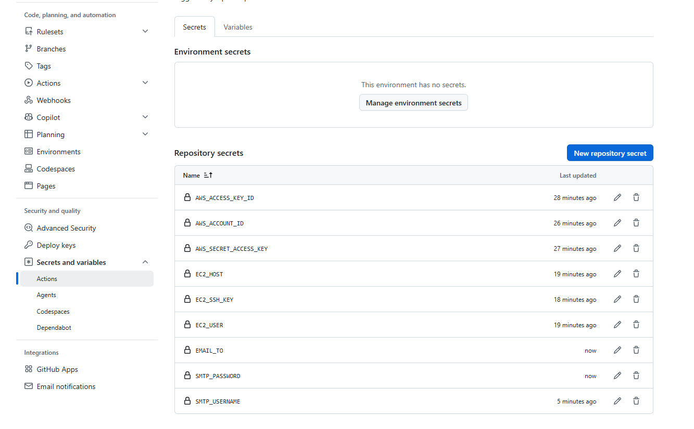

> Non-secret values like the AWS region and ECR repo name don't need to be secrets — they're set directly as `env:` values in the workflow file in Step 9, since there's nothing sensitive about them.

---

## Step 9 — Write the GitHub Actions Workflow

**Why:** This file *is* the pipeline — GitHub reads it from `.github/workflows/` and runs it automatically on every push to `main`. Create `.github/workflows/ci-cd.yml`.

```yaml
name: CI/CD Pipeline - Flask + MongoDB

on:
  push:
    branches: [ main ]

env:
  AWS_REGION: ap-south-1
  ECR_REPO: flask-student-registration

jobs:

  test:
    name: Test
    runs-on: ubuntu-latest
    steps:
      - name: Checkout code
        uses: actions/checkout@v4

      - name: Set up Python
        uses: actions/setup-python@v5
        with:
          python-version: '3.11'

      - name: Install dependencies
        run: |
          python -m pip install --upgrade pip
          pip install -r requirements.txt

      - name: Run tests
        run: pytest -v --junitxml=test-results.xml

      - name: Upload test results
        if: always()
        uses: actions/upload-artifact@v4
        with:
          name: test-results
          path: test-results.xml

  build:
    name: Build & Push to ECR
    needs: test
    runs-on: ubuntu-latest
    outputs:
      image_tag: ${{ steps.vars.outputs.image_tag }}
      image_uri: ${{ steps.vars.outputs.image_uri }}
    steps:
      - name: Checkout code
        uses: actions/checkout@v4

      - name: Set image tag and URI
        id: vars
        run: |
          SHORT_SHA=$(echo "${GITHUB_SHA}" | cut -c1-7)
          echo "image_tag=${SHORT_SHA}" >> "$GITHUB_OUTPUT"
          echo "image_uri=${{ secrets.AWS_ACCOUNT_ID }}.dkr.ecr.${{ env.AWS_REGION }}.amazonaws.com/${{ env.ECR_REPO }}" >> "$GITHUB_OUTPUT"

      - name: Configure AWS credentials
        uses: aws-actions/configure-aws-credentials@v4
        with:
          aws-access-key-id: ${{ secrets.AWS_ACCESS_KEY_ID }}
          aws-secret-access-key: ${{ secrets.AWS_SECRET_ACCESS_KEY }}
          aws-region: ${{ env.AWS_REGION }}

      - name: Login to Amazon ECR
        uses: aws-actions/amazon-ecr-login@v2

      - name: Build Docker image
        run: |
          docker build -t ${{ steps.vars.outputs.image_uri }}:${{ steps.vars.outputs.image_tag }} \
                       -t ${{ steps.vars.outputs.image_uri }}:latest .

      - name: Push image to ECR
        run: |
          docker push ${{ steps.vars.outputs.image_uri }}:${{ steps.vars.outputs.image_tag }}
          docker push ${{ steps.vars.outputs.image_uri }}:latest

  deploy:
    name: Deploy to EC2
    needs: build
    runs-on: ubuntu-latest
    steps:
      - name: Deploy over SSH
        uses: appleboy/ssh-action@v1.0.3
        with:
          host: ${{ secrets.EC2_HOST }}
          username: ${{ secrets.EC2_USER }}
          key: ${{ secrets.EC2_SSH_KEY }}
          script: |
            aws ecr get-login-password --region ${{ env.AWS_REGION }} | \
              docker login --username AWS --password-stdin ${{ secrets.AWS_ACCOUNT_ID }}.dkr.ecr.${{ env.AWS_REGION }}.amazonaws.com
            docker pull ${{ needs.build.outputs.image_uri }}:${{ needs.build.outputs.image_tag }}
            docker stop flask-app || true
            docker rm flask-app || true
            docker run -d --name flask-app \
              --restart unless-stopped \
              -p 5000:5000 \
              --env-file /home/ubuntu/app.env \
              ${{ needs.build.outputs.image_uri }}:${{ needs.build.outputs.image_tag }}

  verify:
    name: Verify Health
    needs: deploy
    runs-on: ubuntu-latest
    steps:
      - name: Curl /health endpoint
        run: |
          sleep 8
          curl -f http://${{ secrets.EC2_HOST }}:5000/health

  notify:
    name: Notify
    needs: [test, build, deploy, verify]
    runs-on: ubuntu-latest
    if: always()
    steps:
      - name: Determine outcome and failed stage
        id: outcome
        run: |
          if [ "${{ needs.test.result }}" == "success" ] && \
             [ "${{ needs.build.result }}" == "success" ] && \
             [ "${{ needs.deploy.result }}" == "success" ] && \
             [ "${{ needs.verify.result }}" == "success" ]; then
            echo "status=success" >> "$GITHUB_OUTPUT"
            echo "failed_stage=none" >> "$GITHUB_OUTPUT"
          else
            echo "status=failure" >> "$GITHUB_OUTPUT"
            if [ "${{ needs.test.result }}" != "success" ]; then
              echo "failed_stage=Test" >> "$GITHUB_OUTPUT"
            elif [ "${{ needs.build.result }}" != "success" ]; then
              echo "failed_stage=Build & Push to ECR" >> "$GITHUB_OUTPUT"
            elif [ "${{ needs.deploy.result }}" != "success" ]; then
              echo "failed_stage=Deploy to EC2" >> "$GITHUB_OUTPUT"
            else
              echo "failed_stage=Verify (health check)" >> "$GITHUB_OUTPUT"
            fi
          fi

      - name: Send success email
        if: steps.outcome.outputs.status == 'success'
        uses: dawidd6/action-send-mail@v3
        with:
          server_address: smtp.gmail.com
          server_port: 465
          username: ${{ secrets.SMTP_USERNAME }}
          password: ${{ secrets.SMTP_PASSWORD }}
          subject: "[SUCCESS] Flask CI/CD — run #${{ github.run_number }}"
          to: ${{ secrets.EMAIL_TO }}
          from: Flask CI/CD Pipeline
          html_body: |
            <h2 style="color:green;">Pipeline succeeded ✅</h2>
            <p><b>Commit SHA:</b> ${{ github.sha }}</p>
            <p><b>Branch:</b> ${{ github.ref_name }}</p>
            <p><b>Image pushed:</b> ${{ needs.build.outputs.image_uri }}:${{ needs.build.outputs.image_tag }}</p>
            <p><b>Deployed to:</b> ${{ secrets.EC2_HOST }}</p>
            <p><b>Pipeline run:</b> <a href="${{ github.server_url }}/${{ github.repository }}/actions/runs/${{ github.run_id }}">View run</a></p>

      - name: Send failure email
        if: steps.outcome.outputs.status == 'failure'
        uses: dawidd6/action-send-mail@v3
        with:
          server_address: smtp.gmail.com
          server_port: 465
          username: ${{ secrets.SMTP_USERNAME }}
          password: ${{ secrets.SMTP_PASSWORD }}
          subject: "[FAILURE] Flask CI/CD — run #${{ github.run_number }} — failed at ${{ steps.outcome.outputs.failed_stage }}"
          to: ${{ secrets.EMAIL_TO }}
          from: Flask CI/CD Pipeline
          html_body: |
            <h2 style="color:red;">Pipeline failed ❌</h2>
            <p><b>Failed stage:</b> ${{ steps.outcome.outputs.failed_stage }}</p>
            <p><b>Commit SHA:</b> ${{ github.sha }}</p>
            <p><b>Branch:</b> ${{ github.ref_name }}</p>
            <p><b>Logs:</b> <a href="${{ github.server_url }}/${{ github.repository }}/actions/runs/${{ github.run_id }}">View run</a></p>
```

> **Why a separate `notify` job with `if: always()`?** By default, a job is skipped if any of its dependencies fail. `notify` needs to run *regardless* of outcome so it can always email you — `if: always()` overrides the default skip behavior, and `needs.<job>.result` lets it inspect what happened in each earlier job to build a specific, honest failure message instead of a generic one.

---

## Step 10 — Run the Pipeline End to End

1. Make a small, real change (e.g. a comment or a README tweak) and push to `main`:
   ```bash
   git add .
   git commit -m "Trigger pipeline: initial full run"
   git push origin main
   ```

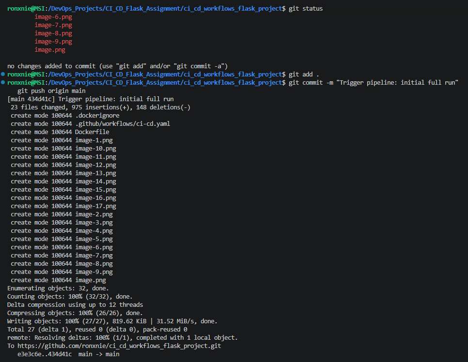

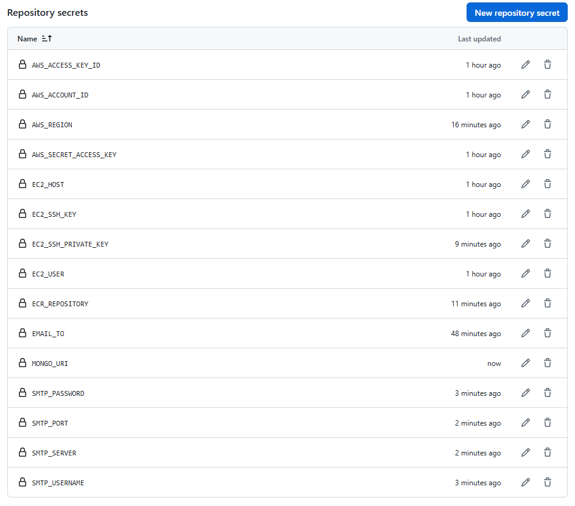

2. In your GitHub repo, go to the **Actions** tab — the workflow should start within seconds of the push automatically (no webhook setup needed; `on: push` handles it).
3. Click into the running workflow → click each job to watch its live logs.
4. Confirm all jobs go green, ending in **Deploy to EC2** and **Verify Health**.
5. Check your inbox for the success email — confirm it has the real commit SHA, image tag, EC2 target, and a working link back to the run.
6. Visit `http://<EC2_HOST>:5000` in your browser to see the live, freshly deployed app.

---

## Step 11 — Test the Failure Path

The rubric explicitly requires proof that failure handling actually works, not just success.

1. Deliberately break something — easiest is to make a test fail on purpose. In `test_app.py`, temporarily change an assertion to something false, e.g.:
   ```python
   assert response.status_code == 999  # intentionally wrong
   ```
2. Commit and push:
   ```bash
   git add .
   git commit -m "Intentional failure: testing failure email path"
   git push origin main
   ```
3. Confirm in the **Actions** tab that the `test` job fails and that `build`, `deploy`, and `verify` show as **skipped** (they depend on `test` succeeding) — this proves the pipeline actually stops instead of continuing on a broken build.
4. Check your inbox for the failure email — confirm the subject and body clearly say **Test** is the failed stage, and it looks visibly different from the success email.
5. Revert your change and push again to confirm the pipeline goes green afterward:
   ```bash
   git revert HEAD
   git push origin main
   ```

---

## Step 12 — Take Your Screenshots

For submission, capture:

- [ ] Full pipeline run, **all jobs green**, in the GitHub Actions run view.
- [ ] The **success email** in your inbox, showing commit SHA / image tag / EC2 target.
- [ ] The **intentionally broken run**, showing `test` failed and later jobs skipped.
- [ ] The **failure email**, showing the correct failed-stage information.

---

## Security Notes

- **Port 5000** is intentionally open to `0.0.0.0/0` so the deployed app is publicly reachable for demo/grading purposes. **Port 22 (SSH)** is restricted to a single known IP (your machine) — it is never opened to the world.
- All secrets (AWS keys, the EC2 `.pem` private key, the Mongo URI, SMTP password) live only in **GitHub Secrets** or in the **`/home/ubuntu/app.env`** file directly on the EC2 instance — never in Git.
- The container always runs with `--restart unless-stopped`, so a server reboot doesn't take the app down.
- The EC2 instance authenticates to ECR via its **IAM instance role**, not stored keys, when the app itself needs registry access; GitHub Actions uses its own dedicated, narrowly-scoped IAM user (Step 7b) — one less credential to leak, and each identity only has the permissions it actually needs.

---

## Troubleshooting

| Symptom | Likely cause | Fix |
|---|---|---|
| Workflow never triggers | Workflow file isn't at exactly `.github/workflows/ci-cd.yml`, or you pushed to a branch other than `main` | Check the file path and branch name match what's in the `on: push: branches:` block |
| `no basic auth credentials` on `docker push` | ECR login step didn't run or the IAM user's policy is missing/wrong | Confirm `AmazonEC2ContainerRegistryPowerUser` is attached to the IAM user in Step 7b |
| SSH deploy step fails | `EC2_SSH_KEY` secret is missing the `BEGIN`/`END` lines, or is the wrong key | Re-copy the **entire** `.pem` file contents into the secret, including both header/footer lines |
| `/health` returns 503 after deploy | App container can't reach MongoDB | Check `/home/ubuntu/app.env` has the correct `MONGO_URI`, and that your Mongo host allows connections from the EC2 instance's IP |
| App unreachable on port 5000 from the browser | `app.run()` bound to `127.0.0.1` instead of `0.0.0.0` | Fix as shown in Step 1, rebuild, redeploy |
| Email step fails with an auth error | Using your real Gmail password instead of an App Password, or 2-Step Verification isn't enabled | Generate a Gmail App Password and use that as `SMTP_PASSWORD` |
| `notify` job doesn't run at all | Missing `if: always()` on the `notify` job | Confirm the job has `if: always()` — without it, `notify` is skipped whenever an earlier job fails |

### Reproducing a deployment manually (if the pipeline were unavailable)

```bash
# From your local machine, with AWS CLI configured:
aws ecr get-login-password --region ap-south-1 | \
  docker login --username AWS --password-stdin <account-id>.dkr.ecr.ap-south-1.amazonaws.com
docker build -t <account-id>.dkr.ecr.ap-south-1.amazonaws.com/flask-student-registration:manual .
docker push <account-id>.dkr.ecr.ap-south-1.amazonaws.com/flask-student-registration:manual

ssh -i flask-deploy-key.pem ubuntu@<EC2_HOST>
docker pull <account-id>.dkr.ecr.ap-south-1.amazonaws.com/flask-student-registration:manual
docker stop flask-app || true && docker rm flask-app || true
docker run -d --name flask-app --restart unless-stopped -p 5000:5000 \
  --env-file /home/ubuntu/app.env \
  <account-id>.dkr.ecr.ap-south-1.amazonaws.com/flask-student-registration:manual
curl http://localhost:5000/health
```

---

## Submission Checklist

- [ ] Forked `flask_Practice` repo, with `Dockerfile`, `.dockerignore`, `/health` route, tests, `.env.example`, and `.github/workflows/ci-cd.yml` committed.
- [ ] Workflow file present (not both a GitHub Actions workflow *and* a Jenkinsfile).
- [ ] This `README.md` updated with prerequisites, secrets setup, and how the deploy step connects to EC2.
- [ ] Screenshot/recording of a full successful pipeline run.
- [ ] Screenshot of the success email.
- [ ] Screenshot of an intentionally failed run + the failure email.
- [ ] Repo link submitted as a text/Word/PDF file via Vlearn.

---

## Grading Rubric Map

| Criterion | Weight | Where it's satisfied here |
|---|---|---|
| Pipeline stages present and passing in order | 25% | Step 9 (`test` → `build` → `deploy` → `verify` jobs with `needs:` dependencies) |
| Docker image built and tagged with commit SHA | 15% | Step 9, `build` job (`image_tag` from `GITHUB_SHA`) |
| Image successfully pushed to ECR | 10% | Step 9, `build` job's push step |
| EC2 deployment replaces the running container | 20% | Step 9, `deploy` job (`stop` → `rm` → `run`) |
| Health check genuinely gates success/failure | 10% | Step 4 (`/health` route) + Step 9 `verify` job (`curl -f`, fails the run on non-200) |
| Email notification, customized, both outcomes | 15% | Step 8 (secrets) + Step 9 `notify` job (`if: always()` with distinct success/failure emails) |
| README documentation quality | 5% | This document |

---

*Repo: [github.com/mohanDevOps-arch/flask_Practice](https://github.com/mohanDevOps-arch/flask_Practice) (forked) — Assignment: CI/CD Pipeline, Flask + MongoDB on EC2.*
